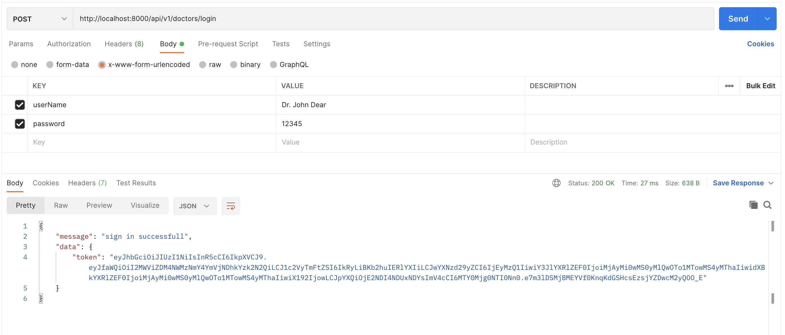
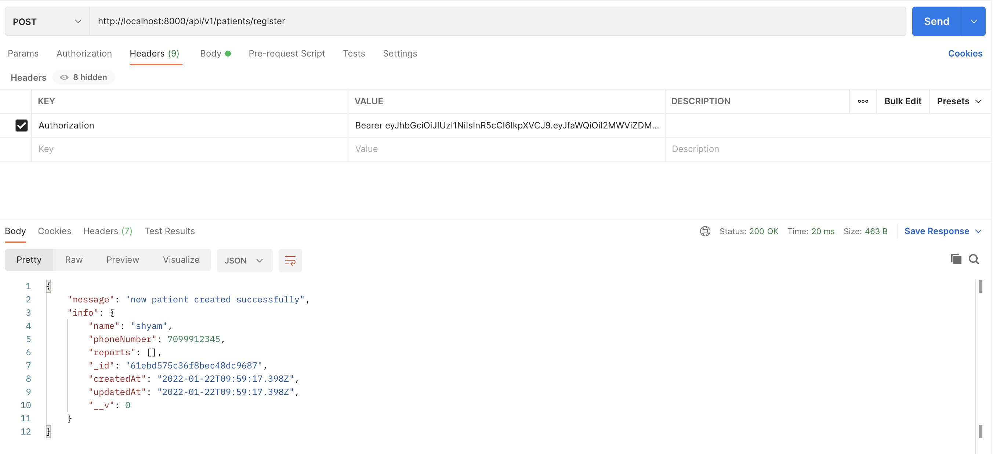

                     🏥 HospitalAPI
We’re going to design an API for the doctors of a Hospital which has been allocated by the
govt for testing and quarantine + well being of COVID-19 patients
- ### There can be 2 types of Users
    - Doctors
    - Patients
- ### Actions Doctors can perform
    - Doctors can log in
    - Each time a patient visits, the doctor will follow 2 steps
    - Register the patient in the app (using phone number, if the patient already exists, just
    return the patient info in the API)
    - After the checkup, create a Report
    - Patient Report will have the following fields
        - Created by doctor
        - Status:
         Can be either of: [Negative Travelled-Quarantine, Symptoms-Quarantine,
        Positive-Admit]

        - Date
- ### Actions Patient can perform
    - View all record of a specific patient 
#

## Routes/API
* [POST] /doctors/register → with username and password
    - if doctor with username does not exist new doctor is created
    

    - if username alredy exists
      
* [POST] /doctors/login → returns the JWT to be used
    - returns a jwt which then have to be send APIs which needs authentications
    
    - wrong password
    

* [POST] /patients/register
    - Only Doctors can regester a patient and Jwt token has to be send in header to access it
    

    - If does not exist new patient is created
    

    - Else If patient alredy Exists the patient info is sent back
    

* [POST] /patients/:id/create_report
    - :id is unique Phone no to identify patient and has to be send as params
    - Only Doctors can create report of patient and Jwt token has to be send in header to create report
    
    - If patient with given phoneNoumber is found
    
    - If patient is not found or invalide status is send
    

* [GET] /patients/:id/all_reports → List all the reports of a   patient oldest to latest
    - Does not need authentication Patients can view Reports by passing their Unique phonenoumber as params
    

* [GET] /reports/:status → List all the reports of all the patients filtered by a specific status
    - Only Doctors can view all reports with specific status
    

            Steps to Setup the project
            - Pre installed [Node, MongoDB]
            - npm init
            - node index.js